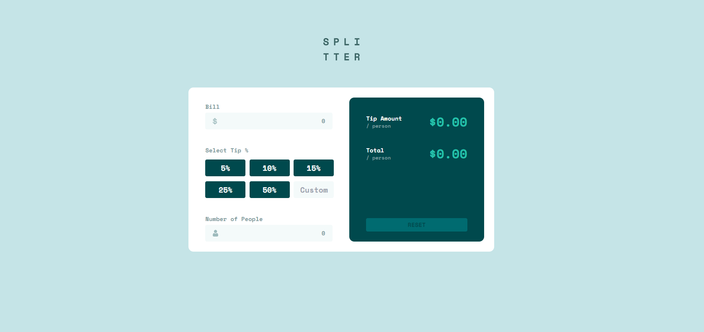

# Frontend Mentor - Tip calculator app solution

This is a solution to the [Tip calculator app challenge on Frontend Mentor](https://www.frontendmentor.io/challenges/tip-calculator-app-ugJNGbJUX). Frontend Mentor challenges help you improve your coding skills by building realistic projects.

## Table of contents

- [Overview](#overview)
  - [The challenge](#the-challenge)
  - [Screenshot](#screenshot)
  - [Links](#links)
- [My process](#my-process)
  - [Built with](#built-with)
  - [What I learned](#what-i-learned)
- [Peer Review](#peer-review)


---


## Overview

### The challenge

Users should be able to:

- View the optimal layout for the app depending on their device's screen size
- See hover states for all interactive elements on the page
- Calculate the correct tip and total cost of the bill per person

### Desktop Screenshot



### Links

- Live Site URL: [Tip Calculator](https://tipcalculator-eosin.vercel.app/)

## My process

### Built with

- Next.js
- Tailwind CSS
- TypeScript
- Mobile-first workflow

### What I learned

- How to imprort fonts into Next.js layout.tsx
```
import { Space_Mono } from "next/font/google";

const spaceMono = Space_Mono({ 
  subsets: ["latin"],
  weight: "700"
});
```

- How to work with radio buttons in the tsx
```
<input 
  type="radio" 
  name="percentage" 
  value="5%" 
  className="appearance-none" 
  onChange={() => handleRadioChange('5%')} 
  checked={selectedValue === '5%'} />
```

- How to use ternary operators for inline className styling
```
<label 
  className={`${selectedValue === '5%' ? 'bg-strongCyan' : 'bg-darkCyan'} 
  rounded flex justify-center items-center h-12 md:h-10 w-36 md:w-24 text-white 
  hover:bg-lightGrayCyan hover:text-darkCyan cursor-pointer`} >
```

## Peer Review

**Name:** first and last **Date/ Time:** 4/3/2024 xx:xx pm

**Comments:**

